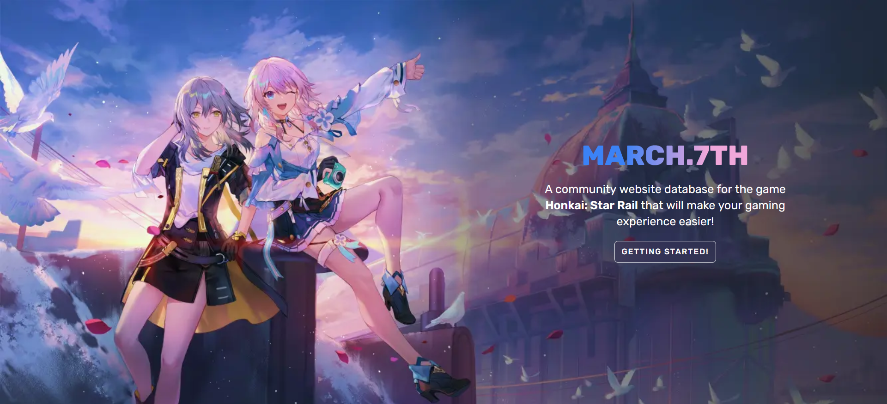

<h1 align="center">MARCH.7TH</h1>
A community website database for the game <b>Honkai: Star Rail</b>
that will make your gaming experience easier!
<br/><br/>
This repository is a migration and clone of my previous closed-source repository that used the <code>NextJS</code> framework. The website is incomplete and abandoned. You can view the website <a href="https://march7th.vercel.app"><b>here</b></a>.

---

## Table of Contents
- [Installations](#installation)
- [Feature](#feature)
- [Need Improvements](#need-improvements)
- [DISCLAIMER](#disclaimer)

## Installation
```sh
git clone https://github.com/rushkii/march7th-svelte.git
cd march7th-svelte
npm install

# Run development mode
npm run dev -- --open

# Run build
npm run build
```

<h2 id="feature">Feature</h2>

<details open>
    <summary>Released</summary>
    <ul>
        <li>characters</li>
    </ul>
</details>

<details>
    <summary>Coming Soon</summary>
    <ul>
        <li>characters:detail</li>
        <li>
            lightcones
            <ul>
                <li>ligtcones:detail</li>
            </ul>
        </li>
        <li>achievements</li>
        <li>fetch in-game profile</li>
        <li>i18n localization translations UI</li>
    </ul>
</details>

## Need Improvements
1. **i18n Localtion Translations**<br/>
We need to improve the localization translations stored in `src/locale`. If you would like to contribute to your own language or fix grammar and typos, please feel free to open a pull request (PR). However, please remember that the JSON data structure must remain the same for other languages, including keys and values.

## DISCLAIMER
This repository or website is not affiliated with **HoYoverse**.<br/>
All game assets, game contents and materials are trademarks and copyrights of **HoYoverse**.
